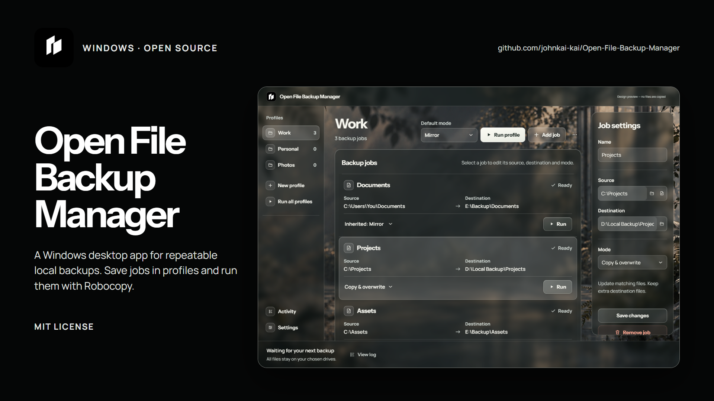
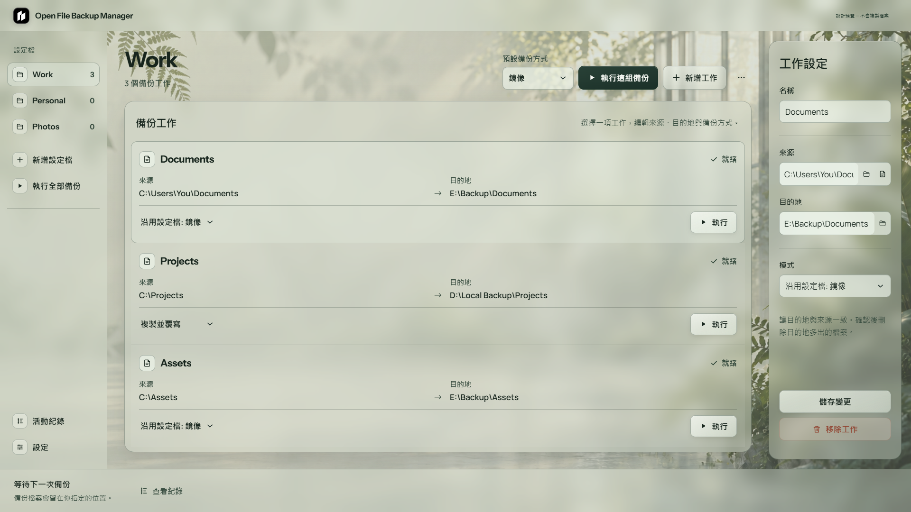
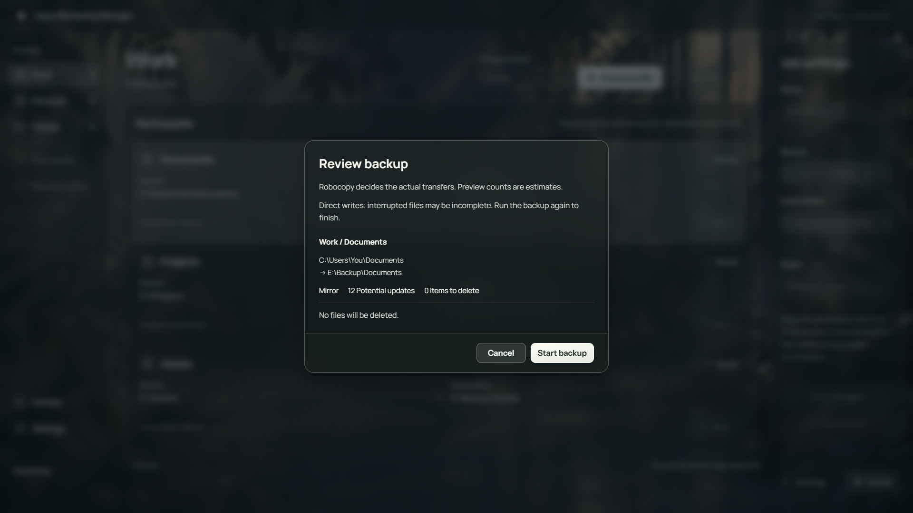
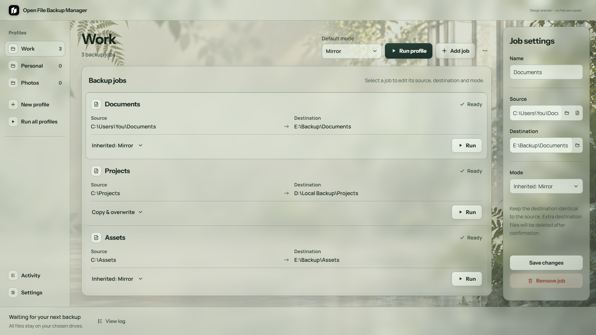
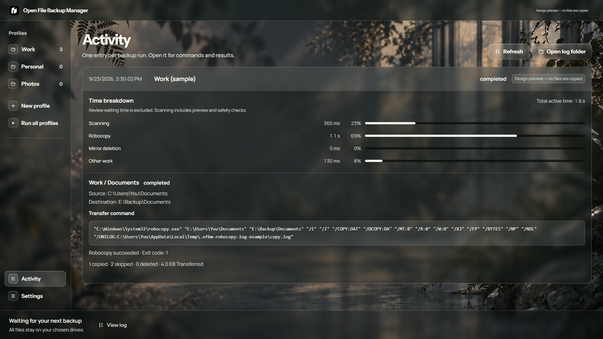
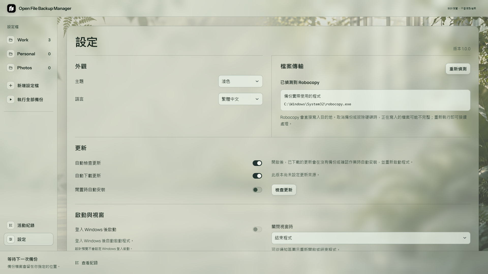

<p align="center"></p>

#  Open File Backup Manager

Windows 開源檔案備份工具。把來源與目的地存成備份工作(Job)，再依用途放進設定檔(Profile)。可以執行單一工作、整組設定檔或全部備份。實際檔案傳輸全部交由 Windows 內建複製工具(Robocopy)處理。

[English](README.md) · [繁體中文](README.CH.md)

## [⬇ 下載 Windows 安裝程式（.exe）](https://github.com/johnkai-kai/Open-File-Backup-Manager/releases/latest/download/Open-File-Backup-Manager-Setup.exe)

Windows x64 · v1.0.0 · [所有發行版](https://github.com/johnkai-kai/Open-File-Backup-Manager/releases)

[](https://github.com/johnkai-kai/Open-File-Backup-Manager/releases)
[](LICENSE)

[](https://github.com/johnkai-kai/Open-File-Backup-Manager/actions/workflows/checks.yml)

**目前僅支援 Windows · MIT 授權**



## 功能

- 建立多組設定檔；每個工作可指定來源、目的地與備份方式。
- 執行單一工作、整組設定檔，或一次執行全部。
- 備份至本機資料夾或外接硬碟；選取的磁碟變更代號時，可依磁碟識別資訊尋找。
- 執行前預覽；鏡像刪除必須另外勾選確認。
- 備份時查看最近回報的檔案；完成後在活動紀錄展開完整的預覽與複製命令、結果、錯誤，以及檢查、複製與刪除各花的時間。
- 在設定頁偵測 Robocopy，查看設定檔與活動紀錄的位置，並直接在檔案總管開啟。
- 可選擇登入 Windows 後啟動，以及關閉視窗時是否留在通知區。
- 提供英文、繁體中文，以及淺色、深色、跟隨系統主題。



## 備份方式

| 方式 | 目的地同名檔案 | 只有目的地存在的項目 |
| --- | --- | --- |
| 鏡像(Mirror)，設定檔預設 | 由 Robocopy 更新變更的檔案 | 預覽並明確確認後，且複製與來源檢查成功才刪除 |
| 複製並覆寫(Copy & overwrite) | 由 Robocopy 更新變更的檔案 | 保留 |

鏡像可能刪除檔案。請使用專門的目的地資料夾並檢查刪除清單。單一檔案來源只能使用複製並覆寫。來源內的連結與接合點會略過並提醒；不會複製或重建連結，也不會備份其指向的內容，目的地對應內容會保留。

## 開始使用

1. 執行安裝程式。可以使用預設安裝位置，也能改選資料夾；桌面捷徑可選。
2. 建立設定檔，新增工作並填寫來源與目的地。
3. 選擇鏡像或複製並覆寫，也可以沿用設定檔的預設方式。
4. 執行工作、設定檔或全部備份，檢查預覽並確認必要的鏡像刪除。

Robocopy 由 Windows 提供，**不會隨本程式打包或下載**。如果無法執行，備份會在開始前停止，設定頁會顯示檢查路徑與 Windows 系統檔案修復指令；這些指令不是另外安裝 Robocopy。程式沒有較慢的備援複製引擎。



## 進度、紀錄與本機資料

Robocopy 會直接寫入目的地。介面顯示目前工作與最近回報的檔案；完成後讀取 Robocopy 的實際摘要，顯示複製、略過與傳輸量。傳輸中的指示器沒有百分比，避免把預估值當成實際進度。

每次備份操作會留下可展開的一筆活動紀錄，包含實際執行的 Robocopy 預覽、安全複查與複製命令、結束代碼及錯誤。新紀錄會拆出預覽與安全檢查、Robocopy 複製、鏡像刪除及其他處理時間；不計入等待你確認預覽的時間。舊紀錄沒有分段計時。設定頁顯示設定檔與活動紀錄路徑，能在檔案總管開啟。備份內容留在指定磁碟；活動紀錄可能包含本機路徑。



取消備份或拔除硬碟，可能讓正在寫入的檔案不完整。硬碟恢復後請重新執行。複製失敗或取消時不會接著進行鏡像刪除。本版不提供快照、版本歷史、加密或排程。

## 外觀與更新

介面預設英文，可在設定切換繁體中文；主題可選淺色、深色或跟隨系統。預設不在登入 Windows 後自動啟動，關閉視窗則直接退出。你可以改成留在右下角通知區，從圖示重新開啟或退出；備份或預覽進行時不能藉由關閉視窗把它藏起來。



新安裝預設自動檢查並下載更新，安裝前由使用者操作。自動檢查和下載可分別關閉，也能手動檢查。可另外啟用閒置時自動安裝；這個選項可能重新啟動程式，但備份或預覽進行中不會安裝。

這次 v1.0.0 重新開始公開版本編號，先前曾發布 v2.0.0。舊版更新器不會把 v1.0.0 視為新版；先前安裝過舊版的人需要手動安裝。

## 安全與驗證

[公開建置流程](https://github.com/johnkai-kai/Open-File-Backup-Manager/actions)會測試原始碼、檢查相依套件、建立安裝程式、以 Microsoft Defender 掃描，並隨發行版提供雜湊值與建置來源證明。這些證據不能保證軟體完全沒有缺陷或威脅。[查看驗證說明](docs/security.html)，或透過 [GitHub 私密通報漏洞](https://github.com/johnkai-kai/Open-File-Backup-Manager/security/advisories/new)。

目前安裝程式尚未簽章，Windows 可能顯示無法辨識發行者。簽章列為後續工作。請從本儲存庫的發行版頁面下載，必要時核對隨附的驗證檔案。

## 從原始碼執行

需要 Windows x64 與 Node.js 24。

```powershell
npm ci
npm test
node tools/desktop-smoke.cjs
npm run build
```

安裝程式產生於 `release/`。OpenDesign 預覽只使用示範路徑，不能實際複製檔案；正式程式與備份功能以本儲存庫為準。前端同步需明確執行並檢查衝突，不是即時同步。

## 授權

專案採用 [MIT 授權](LICENSE)。Manrope 與 Instrument Sans 字體保留各自的 [SIL 開放字體授權](src/assets/Manrope-OFL.txt)（[Instrument Sans 授權文字](src/assets/InstrumentSans-OFL.txt)）；第三方相依套件適用原授權。
