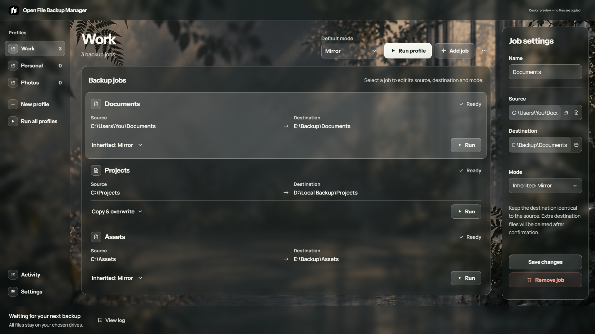
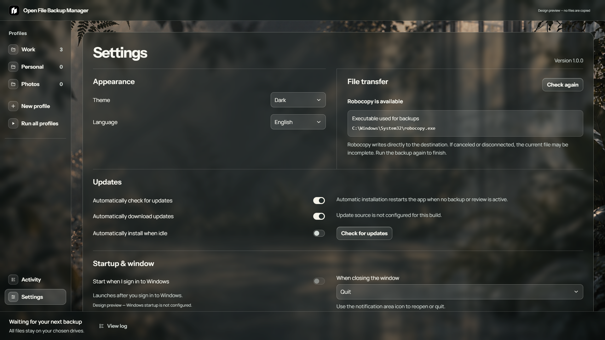

<p align="center"></p>

#  Open File Backup Manager

A Windows desktop app for repeatable local backups. Save sources and destinations as jobs inside named profiles, then run one job, one profile, or all profiles. Windows' built-in Robocopy handles every transfer.

> **Notice:** This release does not include the Robocopy source code and is only compatible with the Windows OS.

[English](README.md) · [Traditional Chinese](README.CH.md)

## [⬇ Download for Windows — installer (.exe)](https://github.com/johnkai-kai/Open-File-Backup-Manager/releases/latest/download/Open-File-Backup-Manager-Setup.exe)

Windows x64 · v1.0.0 · [All releases](https://github.com/johnkai-kai/Open-File-Backup-Manager/releases)

[](https://github.com/johnkai-kai/Open-File-Backup-Manager/releases)
[](LICENSE)

[](https://github.com/johnkai-kai/Open-File-Backup-Manager/actions/workflows/checks.yml)

**Windows only · MIT licensed**



## What it does

- Keep multiple profiles. Each job has its own source, destination, and backup mode.
- Run a single job, a whole profile, or every profile in one operation.
- Copy to a local folder or external drive. Volume identity helps locate a selected drive if its letter changes.
- Review planned changes before writing. Mirror deletion requires a separate, explicit confirmation.
- See the most recently reported file while Robocopy runs. Open one Activity entry per operation for the complete preview and transfer commands, result, errors, and time spent checking, transferring, and deleting.
- Detect the Robocopy executable in Settings, and inspect or open the locations of local settings and activity logs.
- Optionally start after Windows sign-in or keep the app in the notification area when closing its window.
- Use English or Traditional Chinese, with light, dark, and system themes.


## Backup modes

| Mode | Matching destination files | Destination-only items |
| --- | --- | --- |
| Mirror (profile default) | Robocopy updates changed files | Removed only after preview and explicit confirmation, when copying and source validation succeed |
| Copy & overwrite | Robocopy updates changed files | Kept |

Mirror can delete files. Choose a dedicated destination folder and read the deletion list. A single-file source uses Copy & overwrite. Source links and junctions are skipped with a warning; their targets are not copied or recreated, and matching destination content is preserved.

## Getting started

1. Install the app. The wizard provides a default installation folder that you can change, plus a desktop shortcut option.
2. Create a profile, then add a job with a source and destination.
3. Choose Mirror or Copy & overwrite for each job, or inherit the profile's default.
4. Run a job, profile, or everything. Review the destinations and confirm any mirror deletions before starting.

Robocopy is included with Windows and is **not** bundled or downloaded by this app. If it cannot run, Settings shows the checked path and Windows system-file repair commands; those commands do not install a separate copy of Robocopy. Backup stops before any transfer. There is no slower fallback copy engine.


## Progress, Activity, and local data

Robocopy copies directly to the destination. The app shows the active job and most recently reported file, then reads Robocopy's actual summary for copied, skipped, and transferred totals. During a transfer, the activity indicator is deliberately indeterminate; the app does not invent a percentage or completion time.

Activity stores one expandable entry per backup operation, including the complete Robocopy preview, safety recheck, and transfer commands, exit code, and error details. New records break active time into preview and safety checks, Robocopy transfer, mirror deletion, and other work; time spent waiting for your review is excluded. Older records do not have this breakdown. Settings shows the local settings file and activity-log folder, with buttons to open those locations in File Explorer. Backup content stays on your selected drives. Activity logs may contain local file paths.


Canceling or disconnecting a drive may leave the file currently being written incomplete. Run the job again after the drive is available. A failed copy or canceled operation does not proceed to mirror deletion. No snapshot, version history, encryption, or schedule is included.

## Appearance and updates

English is the default language; Traditional Chinese is available in Settings. The app provides light, dark, and system themes. Starting after Windows sign-in is off by default. Closing the window quits by default; you can instead keep the app in the notification area and use its icon to reopen or quit. An active backup or review cannot be hidden by closing the window.



New installations check for updates and download them automatically, then wait for you to install. You can turn checking and downloading off independently, check manually, or enable installation while idle. The optional idle-install setting can restart the app, but an active backup or review blocks installation.

This v1.0.0 relaunch resets the public version sequence from an earlier v2.0.0 release. Updaters on those older installations will not treat v1.0.0 as newer; install this version manually if you used an earlier release.

## Security and verification

The [public workflows](https://github.com/johnkai-kai/Open-File-Backup-Manager/actions) test the source, audit dependencies, build the Windows installer, scan it with Microsoft Defender, and publish checksums and build provenance with each release. These checks provide evidence about the published artifact; they cannot prove software has no defects or threats. [Read the verification guide](docs/security.html) or [report a vulnerability privately](https://github.com/johnkai-kai/Open-File-Backup-Manager/security/advisories/new).

Current installers are unsigned, so Windows may show an unrecognized-publisher warning. Code signing is planned for a future release. Download only from this repository's release page and compare the attached verification files when needed.

## Development

Windows x64 and Node.js 24 are required to build and test locally.

```powershell
npm ci
npm test
node tools/desktop-smoke.cjs
npm run build
```

The installer is written to `release/`. The OpenDesign preview uses sample paths and cannot copy files; this repository contains the application and its backup behavior. Frontend synchronization is explicit and conflict-checked, not realtime.

## License

[MIT](LICENSE). Bundled Manrope and Instrument Sans fonts retain their respective [SIL Open Font License](src/assets/Manrope-OFL.txt) notices ([Instrument Sans notice](src/assets/InstrumentSans-OFL.txt)). Third-party dependencies retain their own licenses.
